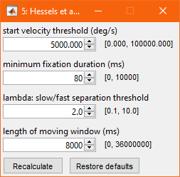
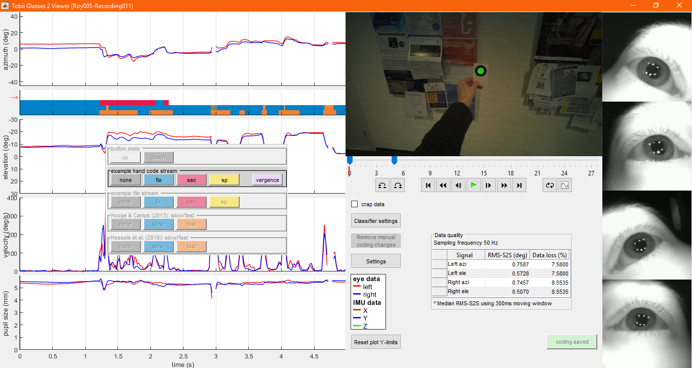
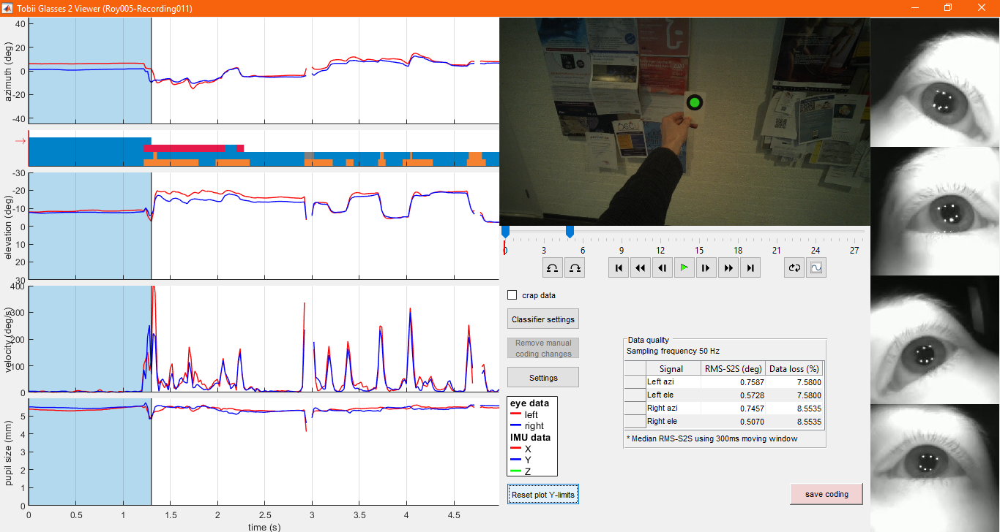
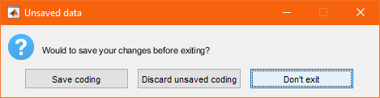

# Manual GlassesViewer

## 1 - opening a Tobii Pro Glasses 2 recording in glassesViewer

First, open MATLAB and open glassesViewer.m in the editor.

When you run glassesViewer.m, a pop-up asks you to select the projects folder of the SD card on which your recordings are placed. Navigate to the projects folder and click "Select folder".

A second pop-up asks you to select the recording that you wish to open in glassesViewer. Recordings are organized by study and participant. First select the study.

Next, select the participant.

Finally select the recording and click "Use selected recording".

When reading the recording, glassesViewer produces some output in the MATLAB command window, among which several measures of eye-tracking data quality.

## 2 - the glassesViewer interface

General interface stuff

Changing the amount of data visible

Settings:

Modify what signals are visible:

Browse through the data:

## 3 - fixation classification

Click on fixation classification results.

Go to classifier settings:

Classifier settings dialog:

Modify settings and recalculate:.

Result of adjusted classifier settings, and save coding:

Coding saved:

## 4 - manual annotation of eye-tracking data

Click on empty coding stream. Then click somewhere in a signal to make the first annotation:

First annotation:

Add a second annotation of a different kind:

Adjust trim of an annotation:

Multiple labels:

## 5 - exiting GlassesViewer

Dialog asking whether to save adjusted coding or not:

