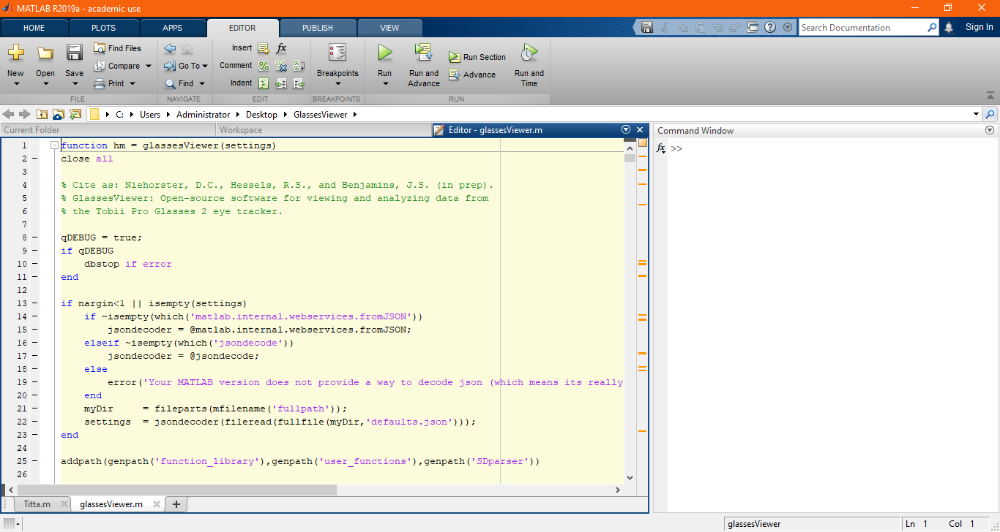
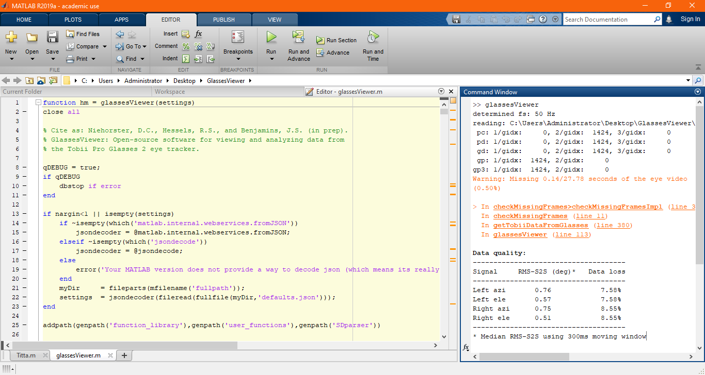
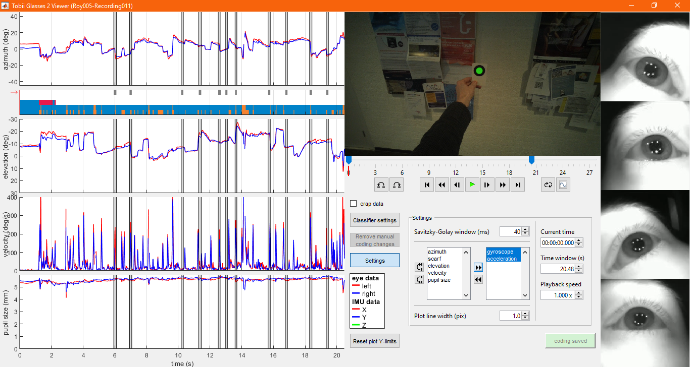
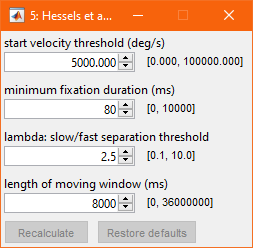

# Manual GlassesViewer

## 1 - opening a Tobii Pro Glasses 2 recording in glassesViewer

First, open MATLAB and open glassesViewer.m in the editor.

When you run glassesViewer.m, a pop-up asks you to select the projects folder of the SD card on which your recordings are placed. Navigate to the projects folder and click "Select folder".

A second pop-up asks you to select the recording that you wish to open in glassesViewer. Recordings are organized by study and participant. First select the study.

Next, select the participant.

Finally select the recording and click "Use selected recording".

When reading the recording, glassesViewer produces some output in the MATLAB command window, among which several measures of eye-tracking data quality.

## 2 - the glassesViewer interface

General interface stuff

Changing the amount of data visible

Browsing through the data

Settings window:

## 3 - fixation classification

Click on fixation classification results.

Adjust settings.

Recalculate.

Result.

Save coding.

## 4 - manual annotation of eye-tracking data

General explanation with example.

Colours become visible in interface.

Adjust trim of a label.

Add labels to different streams.

