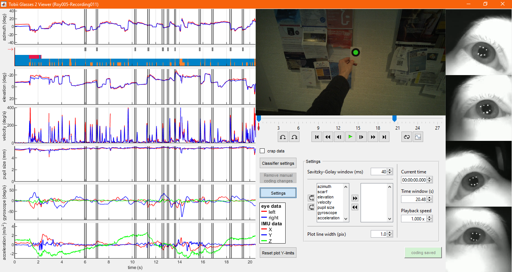
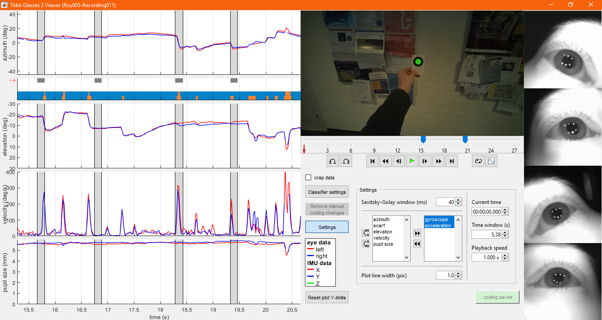
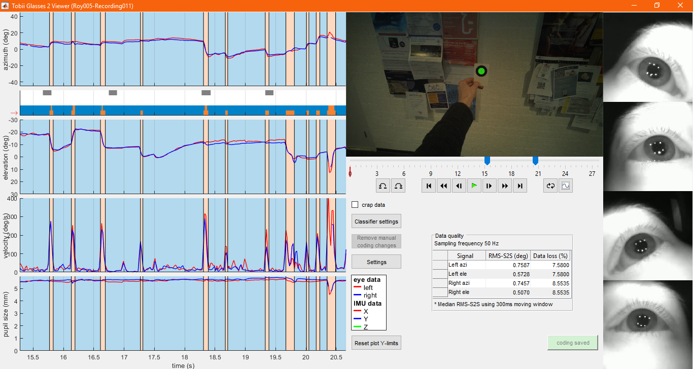
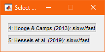
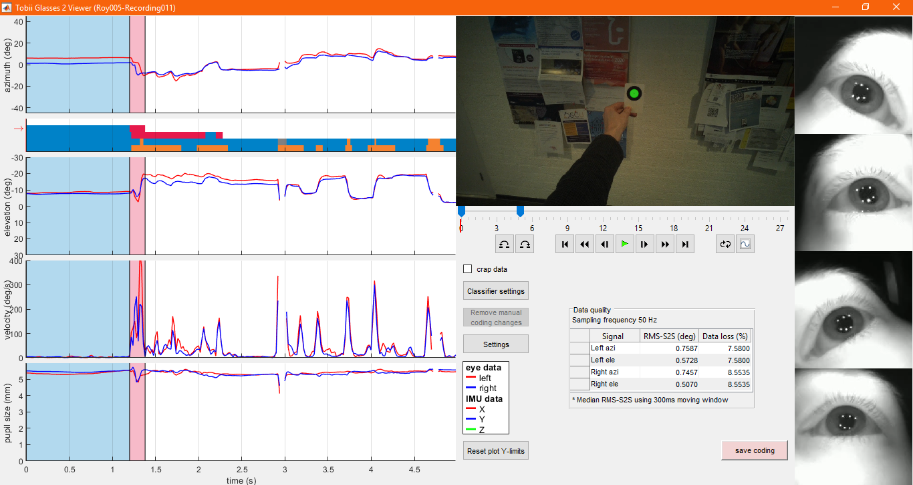
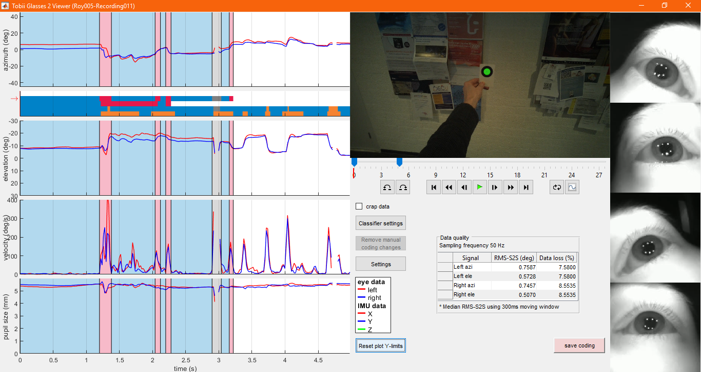
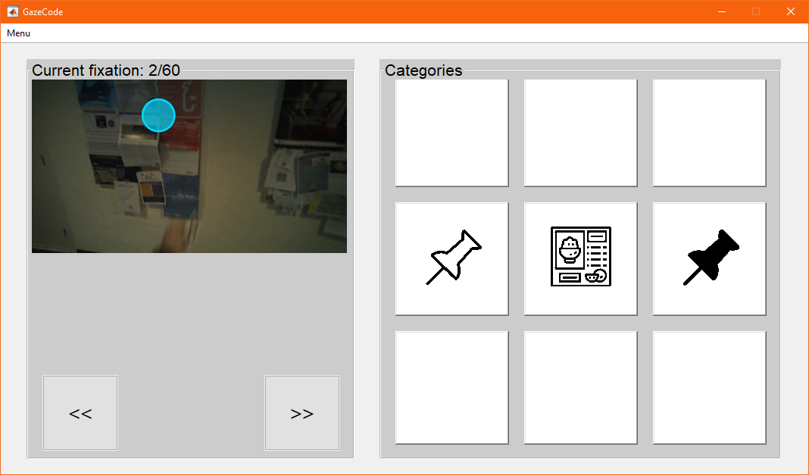
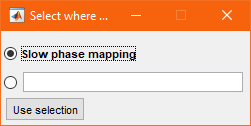
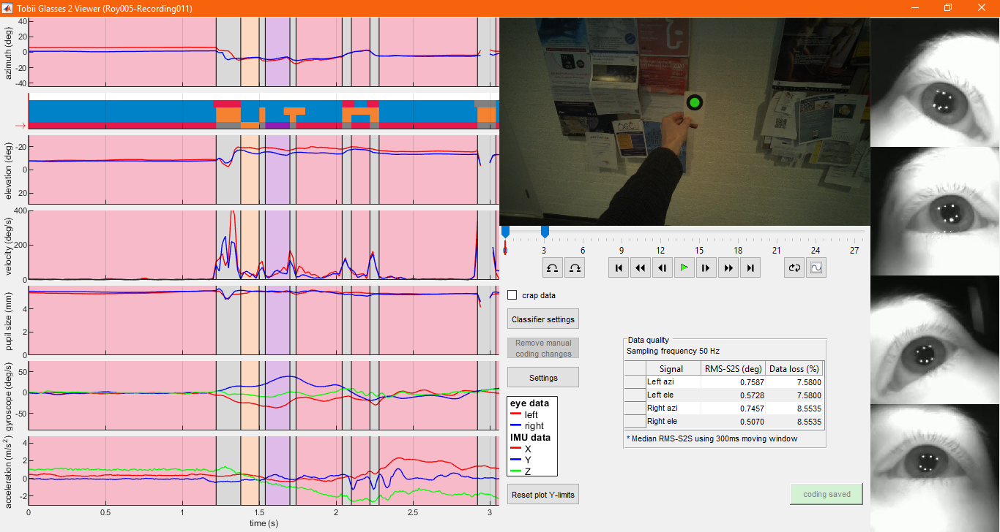

# Manual GlassesViewer

## 1 - Opening a Tobii Pro Glasses 2 recording in glassesViewer

First, open MATLAB and open glassesViewer.m in the editor.

When you run glassesViewer.m, a pop-up asks you to select the projects folder of the SD card on which your recordings are placed. Navigate to the projects folder and click "Select folder". For this example, choose the `projects` directory located inside the `demo_data` directory that is included in this repository.

A second pop-up asks you to select the recording that you wish to open in GlassesViewer. Recordings are organized by study and participant. First select the study.

Next, select the participant.

Finally select the recording and click "Use selected recording".

When reading the recording, glassesViewer produces some output in the MATLAB command window, among which several measures of eye-tracking data quality.

## 2 - The glassesViewer interface

Once the recording is loaded, the glassesViewer interface opens.

The amount of visible data can be changed by dragging the sliders on the timeline underneath the scene video.

Pressing the Settings button opens a panel with various interface configuration options.

Using this panel, one can for instance modify which data stream plots should be shown.

Browse through the data:

## 3 - Fixation classification

Click on the lowest event stream in the scarf plot underneath the first data stream plot on the left of the interface. This makes the selected event stream active, meaning that its codes are displayed by means of highlighting in each of the data stream plots.

The current settings of the slow phase / fast phase classifier algorithm do not appear ideal as some clear saccades are not labeled as fast phase. To change the classifier's settings, click the `Classifier settings` button.
If multiple classifier event streams are defined, clicking this button brings up a dialog where you chose the classifier for which you want to change the settings. Select the `Hessels et al. (2019): slow/fast` one for this example.

This opens the classifier settings dialog.

Change the lambda threshold and click `Recalculate`.

When a new event coding is produced, it is updated in the interface. The red `save coding` button indicates this new event classification has not been saved to file yet.

Press `save coding` to save it to the recording's coding.mat file. When the coding is saved, the button turns green.

## 4 - Manual annotation of eye-tracking data

Click on the second event stream in the event stream scarf (it is currently empty). Then click somewhere in a data stream plot to make the first annotation. On the dialogue box that opens, select the category to annotate the marked episode with.

The code is now applied.

Click further in the stream to add a second event code of a different kind:

Drag the edge of an annotation to adjust its duration:

Add some more event annotations:

## 5 - Exiting GlassesViewer

When exiting glassesViewer, if the coding currently displayed is not saved, a dialog box will appear asking whether to save the changes or not. As before, these will be saved to the `coding.mat` file in the recording's directory.

# Integration with GazeCode

GlassesViewer furthermore offers a close integration with [GazeCode](https://github.com/jsbenjamins/gazecode). Below we document how GazeCode is used for manual mapping of any of the events in any of the event streams introduced above onto the visual stimulus. Please refer to [GazeCode's manual](https://github.com/jsbenjamins/gazecode/blob/master/README.md) for a complete description of GazeCode's functionality.

## 1 - Opening the recording in GazeCode.
First, open the file `<GazeCode_directory>\code\gazecode.m` in matlab.

When you run gazecode.m, a pop-up asks you to indicate what kind of data you want to load. Choose Tobii Pro Glasses 2

A dialogue then asks to select a directory of categories. Select `<GazeCode_directory>\categories\democategory` for this demo.

A dialogue then asks to select a directory of SD card. Select `<GazeCode_directory>\data\demoTobiiSD\projects` for this demo. If you want to code a stream that you have produced with the steps of the GlassesViewer walkthrough above, instead select the directory `<GlassesViewer_directory>\demo_data\projects`, so that the right copy of the demo recording, the one with your coding in it, is loaded.

As with GlassesViewer, you are then asked to select the recording that you wish to open in GazeCode. Recordings are organized by study and participant. First select the study.

Next, select the participant.

Finally select the recording and click "Use selected recording".

You are then asked to select an event stream to code. Select `Hessels et al. (2019): slow/fast`

And select the event category you want to code. Select `slow` phases and click `Use selection`.

Lastly, you'll be asked in which event stream to store the coding you're about to produce. Type in the text box to give your coding stream a name, e.g., `Slow phase mapping`: 

The GazeCode interface is now opened:

## 2 - Manual mapping in GazeCode.
The procedure to manually map event episodes to the visual stimulus is as follows. The GazeCode interface (see screenshot above) allows stepping through all the events that you selected for coding above. You step to the next or the previous using the `<<` and `>>` push buttons underneath the visual stimulus display, or using the `z` and `x` keys on the keyboard, respectively.

The right panel in the GazeCode interface shows the codes you can assign to an event. For this demo, where the participant was asked to search for red pushpins on the notice board, they represent `other color pushpin`, `poster` and `red pushpin`, respectively. The first event episode constitutes the participant looking at the Tobii Pro Glasses 2's calibration marker and is thus left uncoded as it does not fit any of the possible categories. Navigate to the next event.

This next event episode is a look at one of the dark blue pushpins on the notice board, and should thus be coded as `other color pushpin`. To do so, click the white pushpin icon in the right panel, or, for greater efficiency, use the keys on the numpad area of the keyboard. The nine coding buttons in the GazeCode interface spatially correspond to the keys 1-9 on the numpad. In this case, press the key 4. The interface now indicates the selected code:

To remove a coding, press the zero (0) key on the keyboard.

Work through all the events using the procedure above. The next event is a look at a poster, and should thus be coded `poster` with the 5 key.

Once done, close the GazeCode interface. Your coding will be automatically saved to the `coding.mat` file in the recording's directory when the interface is closed. The coding is also saved in text format to a file `gazeCodeCoding.txt` in the recording's directory. Close the interface now for the purpose of this demo.

## 3 - Reviewing or editing an existing manual mapping in GazeCode.

As before, run `gazecode.m` and select the recording you have just coded above. The dialogue for selecting an event stream to view or code now includes a new stream, the `Slow phase mapping` stream we have just created. Select it.

As the interface indicates, for streams created by GazeCode, there is no event code to select for further coding. So press the `Use selection` button to continue. You are now asked to indicate in what event stream to store the coding you will produce:

The bold name indicates the stream that you have just selected to code. Selecting this also as the output stream allows you to modify a previous GazeCode coding. Selecting a new stream by providing a new name allows copying the GazeCode coding before modifying it. Select the `Slow phase mapping` stream. The previous coding now opens in the GazeCode interface, and allows you to review or edit it. Changes will be saved upon exit.

## 4 - Reviewing or editing an existing manual mapping using GlassesViewer.

A GazeCode event stream can also be reviewed or edited using GlassesViewer. As above, run `glassesViewer.m`. Select the recording that you have just coded in GazeCode. If you have been following this walkthrough, that likely is `<GazeCode_directory>\data\demoTobiiSD\projects`. As can be seen in the interface that opens, a new event stream has now been added, select it.

This stream indicates event episodes that are not of interest in gray, uncoded event in red, and coded events in a unique color per category. When clicking in the timeline, the coding panel opens, showing what GazeCode category is currently assigned to an event.

The assigned GazeCode category can be changed with the buttons on the coding panel, and the same options for editing the coding stream (e.g., dragging start or end time of an event) as for the other coding streams are available:

