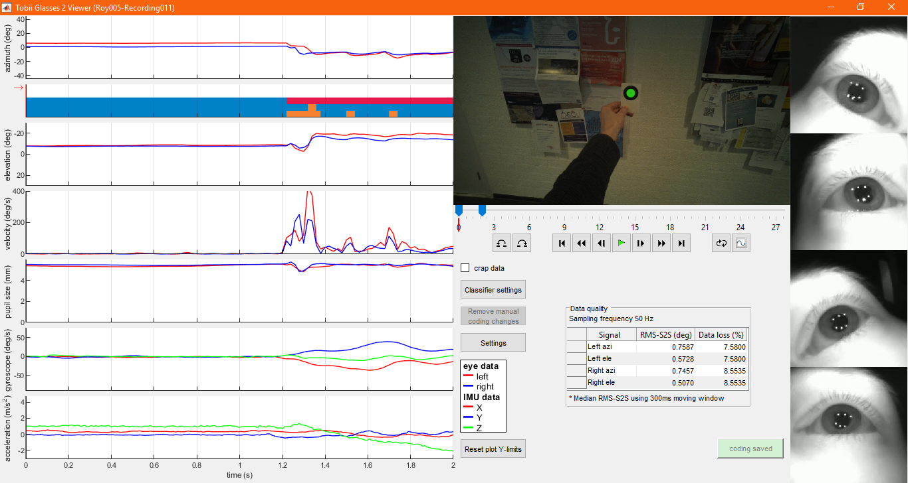
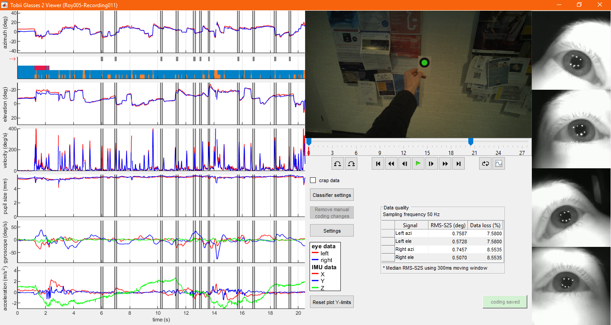

# Manual GlassesViewer

## 1 - Opening a Tobii Pro Glasses 2 recording in glassesViewer

First, open MATLAB and open glassesViewer.m in the editor.

When you run glassesViewer.m, a pop-up asks you to select the projects folder of the SD card on which your recordings are placed. Navigate to the projects folder and click "Select folder". For this example, choose the `demo_data` directory included in this repository.

A second pop-up asks you to select the recording that you wish to open in glassesViewer. Recordings are organized by study and participant. First select the study.

Next, select the participant.

Finally select the recording and click "Use selected recording".

When reading the recording, glassesViewer produces some output in the MATLAB command window, among which several measures of eye-tracking data quality.

## 2 - The glassesViewer interface

Once the recording is loaded, the glassesViewer interface opens.

The amount of visible data can be changed by dragging the sliders on the timeline underneath the scene video.

Pressing the Settings button opens a panel with various interface configuration options.

Using this panel, one can for instance modify which data stream plots should be shown.

Browse through the data:

## 3 - Fixation classification

Click on the lowest event stream in the scarf plot underneath the first data stream plot on the left of the interface. This makes the selected event stream active, meaning that its codes are displayed by means of highlighting in each of the data stream plots.

The current settings of the slow phase / fast phase classifier algorithm do not appear ideal as some clear saccades are not labeled as fast phase. To change the classifier's settings, click the Classifier settings button.
If multiple classifier event streams are defined, clicking this button brings up a dialog where you chose the classifier for which you want to change the settings. Select the Hessels et al. (2019) one for this example.

This opens the classifier settings dialog.

Change the lambda threshold and click recalculate.

When a new event coding is produced, it is updated in the interface. The red Save coding button indicates this new event classification has not been saved to file yet.

Press Save coding to save it to the recording's coding.mat file. When the coding is saved, the button turns green.

## 4 - Manual annotation of eye-tracking data

Click on the second event stream in the event stream scarf, it is currently empty. Then click somewhere in a data stream plot to make the first annotation. On the dialogue box that opens, select the category to annotate the marked episode with.

The code is now applied.

Click further in the stream to add a second event code of a different kind:

Drag the edge of an annotation to adjust its duration:

Add some more event code:

## 5 - exiting GlassesViewer

When exiting glassesViewer, if the coding currently displayed is not saved, a dialog box will appear asking whether to save adjusted coding or not:

# Integration with GazeCode

GlassesViewer furthermore offers a close integration with [GazeCode](https://github.com/jsbenjamins/gazecode). Below we document how GazeCode is used for manual mapping of the participant's fixations onto the visual stimulus. Please refer to GazeCode's manual for a complete description of GazeCode's functionality.

# 1 - opening the recording in GazeCode.
TODO
